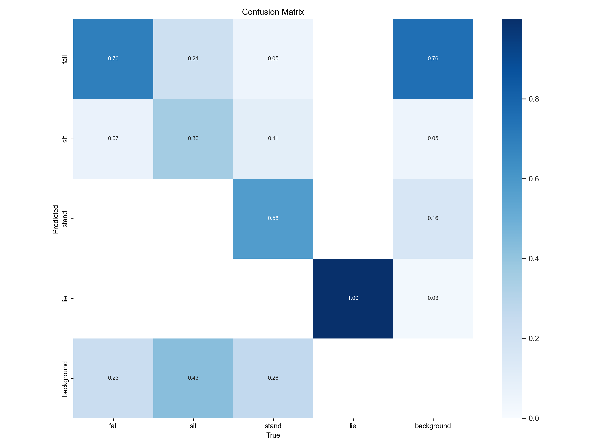
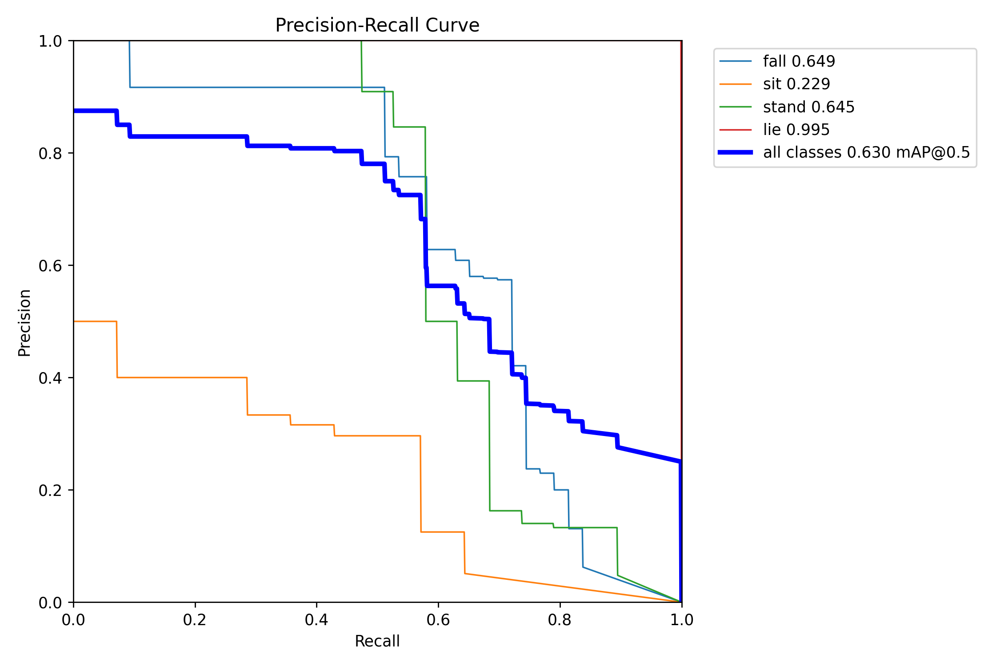
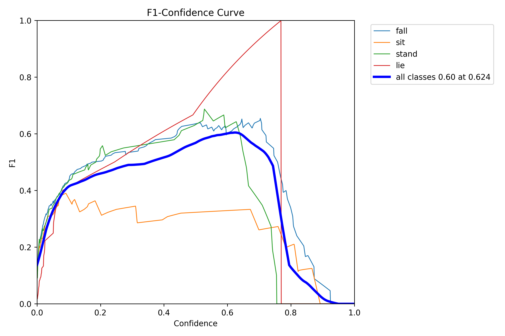

# 基于 YOLOv8 的老人跌倒检测系统

本项目使用 YOLOv8 深度学习模型实现老人跌倒行为的实时检测，支持**图片检测**、**视频检测**和**摄像头实时检测**三种模式。

- **图片检测**：运行 `src/main.py`
- **视频文件检测 / 摄像头检测**：运行 `src/video.py`

---

## 项目结构

```text
elder_fall_defender/
│
├── README.md                    # 项目介绍、部署说明、模型训练过程及结果介绍
├── requirements.txt             # Python 依赖列表
├── src/                         # 驱动程序源代码
├── train/                       # 模型训练脚本
│   ├── train.py                 # YOLOv8 训练脚本
│   ├── split.py                 # 数据集划分脚本
│   ├── split_train_val.py       # 训练/验证集划分
├── tests/                       # 单元测试
├── runs/                        # 训练输出
│   ├── train/fallDetect1/       # 模型训练结果
│   │   ├── *.png                # 训练曲线图
│   │   ├── *.jpg                # 训练过程可视化
│   │   └── args.yaml            # 训练参数配置
│   └── detect/                  # 检测输出结果
│
├── data/                        # 数据集
│   └── fallDownPic/
│       ├── images/              # 训练图片（200+ 张）
│       ├── labels/              # YOLO 格式标注文件
│       ├── Annotation/          # 原始标注文件
│       ├── ImageSets/           # 数据集划分文件
│       ├── dataSet_path/        # 路径配置文件
│       └── mydata.yaml          # 数据集配置文件
│
├── model/                       # 模型存储位置
│   └── best.pt                  # 最佳模型
```

---

## 功能说明

| 功能 | 说明 | 运行文件 |
|:---|:---|:---|
| 图片检测 | 上传单张图片，检测是否跌倒 | `src/main.py` |
| 摄像头实时检测 | 调用电脑摄像头，实时检测 | `src/video.py` |
| 视频文件检测 | 上传视频文件，逐帧检测 | `src/video.py` |

---

## 环境配置

### 1. 创建 Conda 虚拟环境

```bash
conda create -n yolo python==3.10.0
conda activate yolo
```

### 2. 安装 PyTorch

#### 方式一：使用清华源镜像

```bash
pip install torch==2.1.0 torchvision==0.16.0 torchaudio==2.1.0 --index-url https://download.pytorch.org/whl/cu121 -i https://pypi.tuna.tsinghua.edu.cn/simple
```

#### 方式二：使用 Conda 安装

```bash
conda install pytorch==2.1.0 torchvision==0.16.0 torchaudio==2.1.0 pytorch-cuda=12.1 -c pytorch -c nvidia
```

#### 如果没有 NVIDIA GPU，安装 CPU 版本

```bash
pip install torch==2.1.0 torchvision==0.16.0 torchaudio==2.1.0 --index-url https://download.pytorch.org/whl/cpu -i https://pypi.tuna.tsinghua.edu.cn/simple
```

### 3. 安装其他依赖

```bash
pip install -r requirements.txt
```

### 4. 验证环境

```bash
python -c "import torch; print(f'PyTorch: {torch.__version__}'); print(f'CUDA可用: {torch.cuda.is_available()}')"
```

---

## 模型训练

### 数据集

- **来源**：自建跌倒检测数据集
- **类别**：2 类（`fall` / `not_fallen`）
- **图片数量**：跌倒约 208 张，未跌倒约 166 张
- **标注格式**：YOLO 格式
- **数据划分**：训练集 / 验证集 = 8:2

### 训练配置

| 参数 | 设置 |
|:---|:---|
| 基础模型 | YOLOv8n |
| 输入尺寸 | 640 × 640 |
| 训练轮次 | 100 epochs |
| 批次大小 | 16 |
| 优化器 | AdamW |
| 学习率 | 0.001 |

### 开始训练

```bash
cd train
python train.py
```

### 训练结果

训练完成后，模型保存在 `model/best.pt`，同时生成以下评估图表（位于 `runs/train/fallDetect1/`）：

| 图表 | 说明 |
|:---|:---|
| `confusion_matrix.png` | 混淆矩阵 |
| `PR_curve.png` | 精度-召回率曲线 |
| `F1_curve.png` | F1 分数曲线 |
| `P_curve.png` | 精度曲线 |
| `R_curve.png` | 召回率曲线 |

**训练曲线预览：**







---

## 运行项目

### 图片/摄像头检测

```bash
cd src
python main.py
```

### 视频文件检测

```bash
cd src
python video.py
```

### 检测结果

- 跌倒目标会被**绿色矩形框**标出
- 框上方显示类别和置信度（如 `fall 0.92`）
- 检测日志实时显示

---

## 常见问题

**Q：提示 `No module named 'ultralytics'`**

```bash
pip install ultralytics
```

**Q：摄像头无法打开**

检查摄像头权限：
1. Windows 设置 → 隐私和安全性 → 相机
2. 确保"允许应用访问你的相机"已开启
3. 确保 Python 在允许列表中

如果仍无法打开，请先用视频文件模式测试检测功能。

**Q：模型加载失败**

确保 `model/best.pt` 文件存在，或重新训练模型。

**Q：PyTorch 下载太慢**

使用清华源镜像：
```bash
pip install torch==2.1.0 torchvision==0.16.0 --index-url https://download.pytorch.org/whl/cu121 -i https://pypi.tuna.tsinghua.edu.cn/simple
```
```

